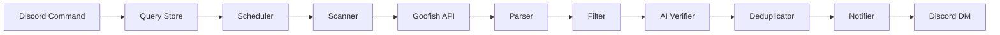

<p align="center">
  <a href="https://github.com/Microck/goofish-watcher">
    
  </a>
</p>

<p align="center">Discord bot that monitors Xianyu/Goofish for listings and sends DM alerts</p>

<p align="center">
  <a href="LICENSE"></a>
  
  
</p>

---

### tl;dr

```bash
# docker (recommended)
docker compose up -d

# manual
pip install -e .
cp .env.example .env  # edit with credentials
python -m bot.main
```

### features

- **configurable queries** - keyword search with include/exclude term filters
- **price filtering** - min/max price range support
- **ai verification** - nvidia nim api filters irrelevant listings
- **discord notifications** - real-time dm alerts with listing details
- **deduplication** - won't notify same listing twice
- **flexible intervals** - 60/180/360 minute scan cycles
- **health monitoring** - auto-alerts for auth failures, scan errors
- **sqlite persistence** - queries, listings, scan history stored locally

### how it works



### requirements

| Requirement | Description |
|-------------|-------------|
| Python 3.11+ | Runtime |
| Discord bot token | Bot authentication |
| NVIDIA NIM API key | AI verification |
| Goofish cookies | Marketplace authentication |
| Chromium | Browser automation (bundled in Docker) |

### commands

| Command | Description |
|---------|-------------|
| `/query add <keyword>` | Add watch query |
| `/query list` | List all queries |
| `/query enable <id>` | Enable query |
| `/query disable <id>` | Disable query |
| `/query remove <id>` | Delete query |
| `/query test <id>` | Run query immediately |
| `/alert mark <id> <label>` | Label a notification |
| `/stats query <id>` | Query statistics |
| `/stats overview` | Global statistics |
| `/stats health` | System health check |

### project structure

```
goofish-watcher/
├── bot/
│   ├── main.py              # discord client entry
│   ├── commands/            # slash commands (query, alert, stats)
│   └── cogs/watcher.py      # scheduler + scan logic
├── core/
│   ├── scanner.py           # playwright-based goofish scraper
│   ├── parser.py            # listing normalization
│   ├── filter.py            # price/term filters
│   ├── verifier.py          # nvidia nim ai verification
│   └── notifier.py          # discord dm sender
├── db/
│   ├── models.py            # data models
│   └── store.py             # sqlite crud operations
├── config.py                # pydantic-settings config
├── Dockerfile
├── docker-compose.yml
└── goofish-watcher.service  # systemd unit file
```

### troubleshooting

| Issue | Solution |
|-------|----------|
| Cookie expired | Re-export cookies from browser, update `cookies.json` |
| No listings found | Check debug screenshots in `debug/`, verify cookies |
| AI verification fails | Check NVIDIA NIM API key and quota |
| Bot not responding | Verify `DISCORD_TOKEN` and bot permissions |
| Docker ARM64 issues | Use provided Dockerfile with Chromium (not Chrome) |

### documentation

- [USAGE.md](USAGE.md) - setup guide, configuration, commands
- [DEPLOY.md](DEPLOY.md) - production deployment (docker, systemd, vps)

### license

MIT
